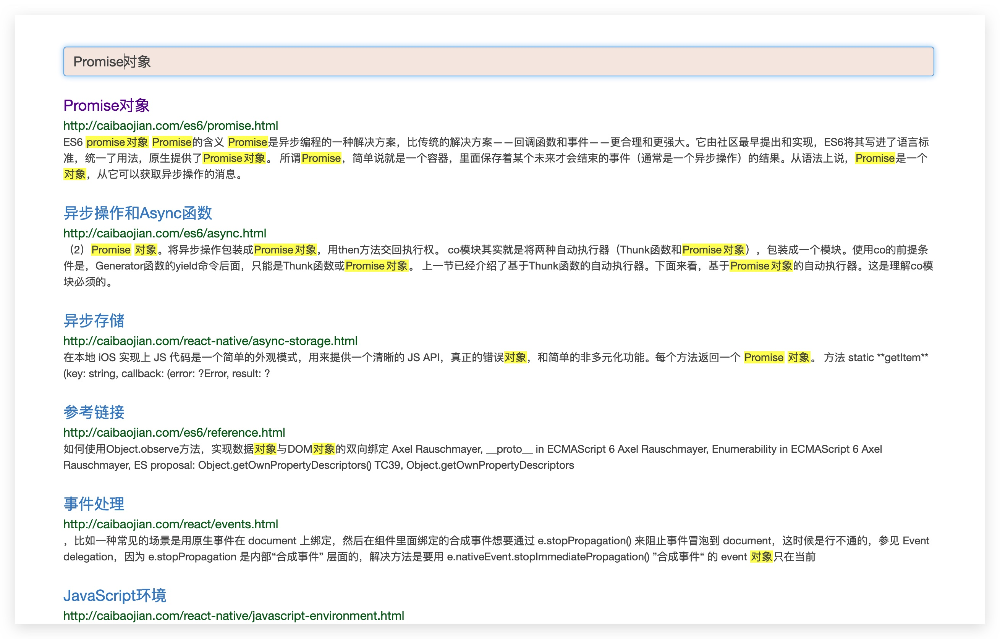

## 文档检索

基于 `ElasticSearch` 的文件检索系统。


本项目录入一些前端学习的gitbook作为demo，效果图如下：





### 项目部署

##### 1. 准备es环境

- 下载并安装elasticsSearch和kibana(非必须)，本文以7.5.0为基准配置。

-  安装中文分词ik-analysis

  > https://github.com/medcl/elasticsearch-analysis-ik
  > 
- 配置用户

	> 创建用户名为`user`, 密码为`pwd`的用户, 执行操作如下:

  ```bash
  ./elasticsearch-users useradd user -p pwd -r kibana_user,supersuer
  ```


##### 2. 准备mysql环境

具体可以参考网上教程，数据库中只含有一个表格

```mysql
SET NAMES utf8mb4;
SET FOREIGN_KEY_CHECKS = 0;

-- ----------------------------
-- Table structure for doc
-- ----------------------------
DROP TABLE IF EXISTS `doc`;
CREATE TABLE `doc` (
  `id` bigint(20) NOT NULL AUTO_INCREMENT COMMENT 'id',
  `title` varchar(2000) NOT NULL DEFAULT '' COMMENT '标题',
  `url` varchar(2000) NOT NULL COMMENT '文章url',
  `times` bigint(20) unsigned NOT NULL DEFAULT '0' COMMENT '访问次数',
  `es_id` varchar(100) DEFAULT '' COMMENT 'esId',
  `updated_time` bigint(20) NOT NULL COMMENT '更新时间',
   PRIMARY KEY (`id`) USING BTREE
) ENGINE=InnoDB AUTO_INCREMENT=2221 DEFAULT CHARSET=utf8mb4;

```


##### 3. 启动项目

IDEA打开项目，或者到处jar包运行接口，默认端口80，gitbook列表变更请修改`spring.gitbook.ds`

##### 4. 数据初始化

- /admin/createIndex
  创建索引

- /admin/update

  更新文档

- /admin/reset

  清空es数据(不删除索引)和mysql数据

浏览器中顺序执行创建索引和更新文档调用即可。